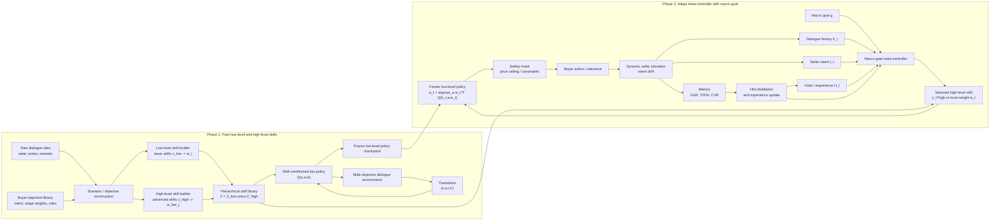

# ALMOND: Khung thuật toán cho điều hướng mục tiêu động trong hội thoại

**ALMOND** là khung thuật toán hai pha cho tác tử hội thoại đa mục tiêu. Tên
làm việc trong tài liệu này là:

> **A**daptive **L**earning for **M**acro-**O**bjective **N**avigation in
> **D**ialogue.

Mục tiêu của ALMOND là học một hệ kỹ năng phân cấp cho chính sách hội thoại, sau
đó dùng một meta-controller để thích ứng mục tiêu cục bộ theo macro goal và trạng
thái hội thoại đang thay đổi.

Trong bài toán negotiation, tác tử đóng vai **Buyer**. Mỗi quyết định được điều
khiển bởi vector mục tiêu 3 chiều:

```text
w = [sl_ratio, fairness, deal_rate]
```

Trong đó:

- `sl_ratio`: lợi ích giá của buyer, ưu tiên mặc cả để có giá thấp hơn.
- `fairness`: mức công bằng và duy trì quan hệ, tránh hành vi quá hung hăng.
- `deal_rate`: khả năng chốt giao dịch, đặc biệt khi seller trở nên cứng rắn hoặc
  có nguy cơ rời đi.

ALMOND khác với một policy đa mục tiêu tĩnh ở chỗ: policy cấp thấp học cách hành
động dưới nhiều trọng số kỹ năng, còn meta-controller cấp cao chọn hoặc điều
chỉnh trọng số `w_t` theo macro goal và seller intent trong từng đoạn hội thoại.

## 1. Tổng quan hai pha

ALMOND gồm hai pha chính.

### Phase 1: Train low-level and high-level skills

Pha này học hệ kỹ năng phân cấp:

- **Low-level skills**: các kỹ năng cơ bản tương ứng với các buyer objective cụ
  thể, mỗi kỹ năng có một vector trọng số cố định.
- **High-level skills**: các kỹ năng tổng hợp theo macro cluster, được tạo từ
  nhiều low-level objective có ý nghĩa gần nhau.
- **Skill-conditioned low policy**: một policy cấp thấp nhận `state` và `w`, sau
  đó chọn hành động hội thoại. Trong code hiện tại, phần này được hiện thực bằng
  R-PADPP / DMORL low policy với dạng `Q(s, a, w)`.

Đầu ra của Phase 1 là:

- skill library gồm basic skills và advanced skills;
- checkpoint low policy đã học hành động theo trọng số kỹ năng;
- policy cấp thấp được đóng băng để dùng trong Phase 2.

### Phase 2: Adapt meta-controller with macro goal

Pha này không học lại low policy từ đầu. Thay vào đó, ALMOND huấn luyện hoặc tinh
chỉnh meta-controller để biến một macro goal mơ hồ thành mục tiêu cục bộ `w_t`
phù hợp với từng thời điểm hội thoại.

Meta-controller nhận:

- macro goal của buyer;
- dialogue history hiện tại;
- seller intent hoặc drift signal;
- constraints như price ceiling, target price, turn limit;
- hint playbook và experience buffer từ các episode trước.

Meta-controller sinh ra:

- một high-level skill `z_t^high`; hoặc
- trực tiếp một vector local objective `w_t = [sl_ratio, fairness, deal_rate]`.

Low policy đã đóng băng dùng `w_t` này để chọn hành động. Sau mỗi episode, kết
quả được đánh giá bằng các metric như GSR, T2DA, CVR. Feedback đó được distill
thành hint hoặc lưu vào experience buffer để cải thiện meta-controller ở các
episode sau.

## 2. Các module chính

### 2.1 Objective and scenario module

Module này chuẩn bị không gian mục tiêu và dữ liệu huấn luyện.

**Input**

- Raw dialogue cases từ benchmark, ví dụ Craigslist Bargain hoặc DuRecDial-derived
  negotiation cases.
- Buyer objective library: danh sách intent, mô tả tự nhiên, weight vector, stage
  weights và adaptation rules.

**Output**

- H-MOD / ALMOND scenario file gồm:
  - `macro_goal`;
  - `buyer_intent_id`;
  - `static_w`;
  - buyer constraints;
  - seller persona;
  - drift mode;
  - expected weight shift.

**Vai trò**

Module này biến dữ liệu hội thoại gốc thành các episode có macro goal và seller
drift rõ ràng, nhờ đó Phase 1 và Phase 2 có thể học trên cùng một interface.

### 2.2 Low-level skill builder

Low-level skill builder tạo các **basic skills** từ objective library.

Mỗi basic skill có dạng:

```text
z_i^low = {
  name,
  description,
  weight_vector w_i,
  cluster,
  source = "buyer_objective"
}
```

**Chức năng**

- Chọn các objective cơ bản từ objective library.
- Map mỗi objective thành một vector `w_i`.
- Chuẩn hóa vector về không gian 3 chiều `[sl_ratio, fairness, deal_rate]`.
- Lưu vào skill library để low policy huấn luyện trên từng skill.

**Ý nghĩa thuật toán**

Low-level skills cho policy học các hành vi cơ bản như:

- mặc cả mạnh để giảm giá;
- giữ fairness để tránh làm seller khó chịu;
- ưu tiên chốt deal khi seller có dấu hiệu rời đi.

### 2.3 High-level skill builder

High-level skill builder tạo các **advanced skills** hoặc **composite skills**.

Thay vì đại diện cho một objective đơn lẻ, high-level skill đại diện cho một cụm
macro objective. Trong code, các objective cùng cluster được gom lại và lấy trung
bình trọng số:

```text
z_j^high -> w_bar_j = average({w_i | objective_i in cluster_j})
```

**Chức năng**

- Nhóm các objective theo macro cluster.
- Tạo skill tổng hợp từ các objective thành viên.
- Cung cấp một tầng kỹ năng trừu tượng hơn cho meta-controller.

**Ý nghĩa thuật toán**

High-level skills là cầu nối giữa macro goal ngôn ngữ tự nhiên và hành động cấp
thấp. Khi macro goal chưa rõ ràng hoặc thay đổi theo hội thoại, meta-controller
có thể chọn một high-level skill thay vì phải chọn trực tiếp từng hành động.

### 2.4 Hierarchical skill library

Skill library lưu cả hai loại kỹ năng:

```text
Z = Z_low union Z_high
```

Trong đó:

- `Z_low`: basic buyer-objective skills.
- `Z_high`: advanced macro-cluster skills.

**Chức năng**

- Cung cấp tập skill cho Phase 1 training.
- Cung cấp các skill đã học cho Phase 2 meta-controller.
- Là bộ nhớ cố định về khả năng hành động của tác tử.

### 2.5 Skill-conditioned low policy

Đây là policy cấp thấp. Nó nhận trạng thái hội thoại `s` và vector mục tiêu `w`,
sau đó chọn hành động `a`.

Dạng tổng quát:

```text
a_t = argmax_a w_t^T Q(s_t, a, w_t)
```

Trong code, low policy có thể được triển khai bằng R-PADPP / DMORL:

- Phase 1 học anchor/basic skills.
- Phase 2 của R-PADPP dùng regret-gated GPI để mở rộng khả năng reuse knowledge
  giữa các trọng số đã hội tụ.
- Sau khi học xong, checkpoint low policy được đóng băng để meta-controller sử
  dụng.

**Chức năng**

- Biến `w_t` thành hành động hội thoại cụ thể.
- Không tự quyết định macro goal.
- Không tự thích ứng bằng ngôn ngữ; nó chỉ thực thi local objective mà
  meta-controller cung cấp.

### 2.6 Macro-goal meta-controller

Đây là module trung tâm của Phase 2.

**Input**

```text
macro_goal g
dialogue history h_t
seller intent I_t
buyer constraints C
hints / experience H_t
previous weight w_{t-1}
```

**Output**

```text
z_t^high or w_t
```

Trong chế độ đơn giản, meta-controller có thể là rule scaffold:

- seller neutral -> giữ hoặc tăng `sl_ratio`;
- seller firm -> giảm `sl_ratio`, tăng `deal_rate`;
- seller final_offer -> ưu tiên chốt nếu giá trong ceiling;
- seller walkaway_risk -> tăng `deal_rate` và `fairness`.

Trong chế độ LLM reflection, meta-controller đọc macro goal và dialogue visible
history, sau đó sinh vector `w_t`.

**Vai trò**

Meta-controller là nơi ALMOND thực hiện điều hướng mục tiêu động. Nó quyết định
trong ngắn hạn tác tử nên ưu tiên giá, fairness hay khả năng chốt deal.

### 2.7 Intent-drift detector

Trong biến thể two-agent, meta-controller được tách thành hai agent. Agent đầu
tiên là intent-drift detector.

**Input**

- visible dialogue;
- current turn;
- previously believed seller intent;
- seller intent catalog;
- detector hints.

**Output**

```text
{
  drift_detected: true/false,
  current_intent: neutral | firm | final_offer | walkaway_risk,
  reason: evidence from dialogue
}
```

**Chức năng**

- Phát hiện seller intent có drift hay chưa.
- Xác định trạng thái hiện tại của seller.
- Trong training two-agent, detector được score bằng intent accuracy và drift
  accuracy.

### 2.8 High-policy adapter

Agent thứ hai trong biến thể two-agent là high-policy adapter.

**Input**

- macro goal;
- current seller intent;
- dialogue history;
- previous weight;
- buyer constraints;
- policy hints.

**Output**

High-policy adapter sinh phân bổ ngôn ngữ tự nhiên trước:

```text
"In the short term, focus X% on sl_ratio,
 Y% on fairness, Z% on deal_rate"
```

Sau đó phân bổ này được parse thành:

```text
w_t = [X/100, Y/100, Z/100]
```

**Chức năng**

- Biến macro goal và seller intent thành local weight.
- Giải thích vì sao trọng số cần dịch chuyển.
- Cho phép training hint playbook riêng cho việc chọn `w_t`.

### 2.9 Safety mask

Safety mask nằm giữa low policy và môi trường.

**Chức năng**

- Kiểm tra hành động có vi phạm buyer constraints hay không.
- Chặn hoặc sửa hành động vượt price ceiling.
- Ghi lại blocked violation và actual violation để tính CVR.

Safety mask giúp tách hai việc:

- policy có thể đề xuất hành động;
- hệ thống vẫn đảm bảo constraint trước khi phát ngôn.

### 2.10 Dynamic seller simulator

Seller simulator tạo phản hồi của seller và drift intent theo kịch bản.

Các drift mode chính:

- `static_no_drift`: seller giữ intent ổn định.
- `gradual_firming`: seller dần trở nên cứng rắn.
- `abrupt_final_offer`: seller đưa final offer ở một turn cụ thể.
- `frustrated_walkaway`: seller có nguy cơ rời đi sau nhiều áp lực.

**Vai trò**

Simulator cung cấp môi trường có drift để kiểm tra xem meta-controller có thật
sự thích ứng `w_t` đúng lúc hay không.

### 2.11 Feedback, hint distillation, and experience memory

Sau mỗi episode, ALMOND tính các metric:

- **GSR**: Goal Success Rate, thành công khi chốt deal, giá không vượt ceiling,
  và số turn không vượt limit.
- **T2DA**: Turn-to-Drift-Adaptation, số turn từ lúc seller drift đến lúc `w_t`
  thay đổi đủ lớn theo hướng kỳ vọng.
- **CVR**: Constraint Violation Rate, tỷ lệ hành động vi phạm constraint.

Feedback được dùng theo hai cách:

1. **Hint distillation**: LLM distiller đọc metric digest và viết lại hint
   playbook tổng quát.
2. **Experience memory**: lưu các episode thành công/thất bại theo cặp
   `(macro_goal, drift_mode)` để cung cấp context cho reflection lần sau.

## 3. Flow hoạt động tổng thể



## 4. Flow chi tiết của Phase 1

```text
1. Load objective library.
2. Build low-level skills:
   objective_i -> weight_vector w_i -> z_i^low.
3. Build high-level skills:
   cluster_j = {objective_i}
   average weights -> w_bar_j -> z_j^high.
4. Save hierarchical skill library:
   Z = Z_low union Z_high.
5. Train skill-conditioned low policy:
   sample skill z
   use its weight w
   interact with dialogue environment
   update Q(s,a,w).
6. Save frozen low-level policy checkpoint.
```

Pha này trả lời câu hỏi: **tác tử có thể làm gì?**

Nó học các hành vi có thể tái sử dụng dưới nhiều mục tiêu khác nhau, nhưng chưa
phải là nơi quyết định macro goal trong từng tình huống.

## 5. Flow chi tiết của Phase 2

```text
1. Receive macro goal g and initial dialogue state.
2. Detect or infer seller intent I_t.
3. Meta-controller reads:
   g, h_t, I_t, constraints, hints, previous w.
4. Meta-controller selects:
   a high-level skill z_t^high, or
   a local objective vector w_t.
5. Frozen low-level policy executes:
   a_t = argmax_a w_t^T Q(h_t, a, w_t).
6. Safety mask checks constraints.
7. Buyer sends utterance/action.
8. Seller simulator responds and may drift intent.
9. Metrics are computed after episode.
10. Hint distiller and experience buffer update meta-controller memory.
```

Pha này trả lời câu hỏi: **tác tử nên dùng kỹ năng nào, với trọng số nào, vào
thời điểm nào?**

## 6. Inference loop

Trong inference, low policy đã đóng băng. ALMOND chỉ cập nhật `w_t` hoặc skill
cấp cao theo chu kỳ reflection horizon `T`, hoặc khi detector phát hiện drift.

```text
Initialize dialogue.
Initialize previous weight w_0 from macro goal.

For each turn t:
  Observe dialogue history h_t.
  Detect seller intent I_t.

  If t = 0, t mod T = 0, or drift_detected:
      meta-controller selects z_t^high or w_t.
  Else:
      carry previous w_{t-1}.

  low policy selects action under w_t.
  safety mask enforces constraints.
  seller responds.

End episode.
Compute GSR, T2DA, CVR.
Update hints / experience memory.
```

## 7. Quan hệ giữa các module trong code

Mapping khái niệm ALMOND với code hiện tại:

| ALMOND module | Code tương ứng | Vai trò |
|---|---|---|
| Objective library | `config/scenario/hmod_buyer_objectives.py`, `hmod/objectives.py` | Định nghĩa buyer objectives và weight vectors |
| Scenario construction | `scripts/generate_hmod_benchmark_scenarios.py`, `hmod/scenario.py` | Tạo scenario có macro goal, constraints, drift |
| Low-level skill builder | `hmod/training.py::_build_basic_skills` | Tạo basic skills từ objective ids |
| High-level skill builder | `hmod/training.py::_build_advanced_skills` | Tạo composite skills theo macro clusters |
| Skill library | `dmorl.llm_controller.SkillLibrary` | Lưu basic + advanced skills |
| Low-level policy | `dmorl/trainer.py`, `hmod/low_policy.py` | Học và dùng `Q(s,a,w)` |
| Meta-controller | `hmod/policy.py`, `hmod/training.py::get_dynamic_weight` | Chọn dynamic `w_t` |
| Intent detector | `hmod/intent_detector.py` | Phát hiện seller drift và intent |
| High-policy adapter | `hmod/high_policy.py` | Sinh allocation ngôn ngữ tự nhiên và parse thành `w_t` |
| Two-agent controller | `hmod/two_agent_controller.py` | Kết hợp detector và high-policy |
| Hint training | `train_hmod.py`, `hmod/hint_trainer.py` | Self-play và distill general hints |
| Two-agent hint training | `train_hmod_2agent.py`, `hmod/two_agent_trainer.py` | Train riêng detector hints và policy hints |
| Safety mask | `hmod/policy.py` | Chặn constraint violation |
| Dynamic seller simulator | `hmod/simulator.py` | Mô phỏng seller intent drift |
| Metrics | `hmod/metrics.py` | GSR, T2DA, CVR |

## 8. Điểm chính để viết trong paper

Một đoạn mô tả ngắn có thể dùng trong paper:

> ALMOND decomposes dynamic objective-conditioned dialogue control into two
> phases. The first phase constructs a hierarchical skill space from buyer
> objectives: low-level skills capture atomic objective preferences, while
> high-level skills summarize macro-objective clusters. A skill-conditioned
> low-level policy is trained to execute actions under arbitrary objective
> weights and is frozen after training. The second phase adapts a macro-goal
> meta-controller. Given the ambiguous buyer macro goal, dialogue history,
> seller intent drift, constraints, and learned hints, the meta-controller
> selects a high-level skill or local weight vector that drives the frozen
> low-level policy. Episode-level metrics are distilled into reusable hints and
> experience summaries, enabling the controller to improve its adaptation across
> dialogues without retraining the low-level policy.

## 9. Tóm tắt đóng góp

ALMOND có ba ý chính:

1. **Skill hierarchy**: tách low-level objective skills và high-level macro
   skills để policy có khả năng tái sử dụng hành vi.
2. **Macro-goal adaptation**: dùng meta-controller để map macro goal mơ hồ thành
   local skill hoặc `w_t` trong từng trạng thái hội thoại.
3. **Feedback-driven controller improvement**: dùng GSR, T2DA, CVR để tạo hints
   và experience memory, giúp meta-controller thích ứng tốt hơn với seller drift.

