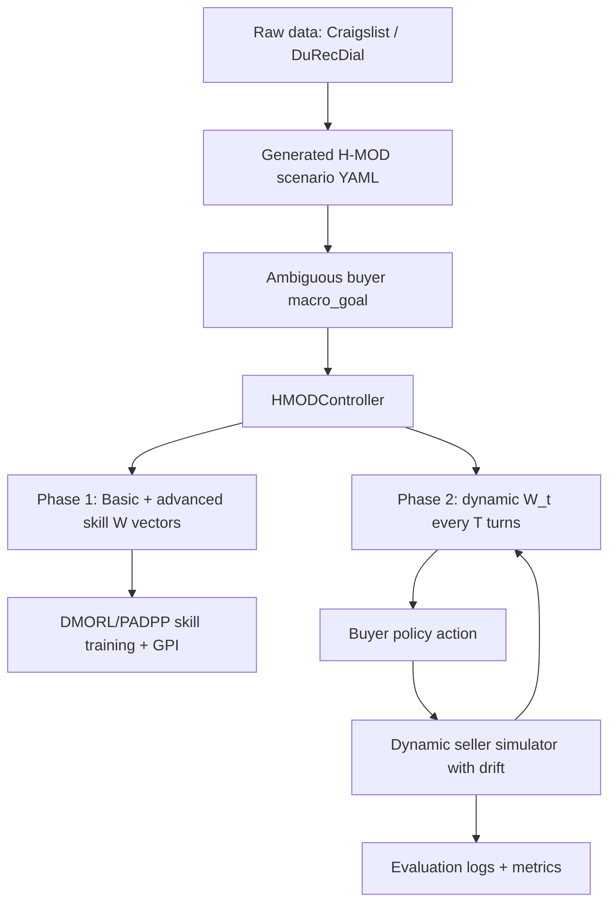

# H-MOD: Buyer-Agent Objective Drift Training and Evaluation

> **Merge note (R-PADPP main).** H-MOD is merged onto the R-PADPP `main` branch
> and adapted in three ways:
> 1. **3-D objectives.** The low policy is trained on
>    `[sl_ratio, fairness, deal_rate]` (no `avg_turn`). `OBJECTIVE_ORDER` is now
>    3-D and `hmod.scenario.coerce_objective_weight` collapses any legacy 4-D
>    vector (dropping `avg_turn`, folding its urgency into `deal_rate`), so the
>    generated 4-D scenario files below still load unchanged.
> 2. **Neural low policy.** Pass `--low_policy_checkpoint <dmorl_phase2.pth>` to
>    `eval_hmod.py` to drive the trained R-PADPP model (`hmod/low_policy.py` →
>    `hmod.policy.NeuralBuyerPolicy`) instead of the rule-scaffold buyer.
> 3. **Experience accumulation.** `--use_experience_buffer`
>    (`hmod/experience.py`) feeds a summary of past episode outcomes into the LLM
>    reflection prompt so `w_local` improves over time.
> 4. **Hint training (`train_hmod.py`).** The LLM controller self-plays against
>    the drift simulator, reads back the full metric feedback with a glossary,
>    and an LLM distiller turns it into a reusable playbook of *general hints*
>    saved to JSON. Eval loads it via `--hints_file` to ground inference. See
>    section 4.4 below.
>
> The merged-pipeline overview lives in the main `README.md` (section 7). Some
> examples below still show the original 4-D weights, which load fine via the
> 3-D coercion above.

This README documents the current H-MOD implementation in this repository.
H-MOD is implemented as a buyer-agent extension on top of the existing DMORL/PADPP
multi-objective dialogue policy code.

## 1. What H-MOD Does

H-MOD trains and evaluates an agent that plays the Buyer role.

- Assistant = Buyer agent.
- User = Seller simulator.
- The input objective is an ambiguous natural-language buyer goal.
- The controller maps the objective to a local multi-objective weight vector `w_t`.
- During a dialogue, seller intent can drift. H-MOD updates `w_t` every `T` turns.
- The learned policy still uses the DMORL/PADPP action-selection and GPI machinery.

Objective order:

```text
[sl_ratio, fairness, deal_rate, avg_turn]
```

Meaning:

- `sl_ratio`: buyer price gain. Higher means bargain harder for a lower price.
- `fairness`: relationship/fairness. Higher means avoid hostile lowballing.
- `deal_rate`: probability of closing a deal.
- `avg_turn`: time efficiency and urgency.

High-level flow:



## 2. Important Files

Core H-MOD code:

- `hmod/scenario.py`: scenario schema and YAML loader.
- `hmod/simulator.py`: dynamic Seller simulator with deterministic intent drift.
- `hmod/objectives.py`: maps ambiguous buyer objectives to weight vectors.
- `hmod/policy.py`: rule scaffold meta-controller, LLM reflection controller, buyer policy, safety masking.
- `hmod/training.py`: DMORL-compatible `HMODController` for Phase 1 skills and Phase 2 dynamic weights.
- `hmod/runner.py`: executable H-MOD evaluation loop.
- `hmod/metrics.py`: GSR, T2DA, CVR, aggregate metrics.
- `hmod/judge.py`: rule or LLM deal judge.

Scenario and objective files:

- `config/scenario/hmod_buyer_objectives.py`: buyer objective library.
- `config/scenario/hmod_buyer_drift_scenarios.yaml`: small hand-written smoke scenario file.
- `config/scenario/generated/hmod_bargain_train_scenarios.yaml`: generated Bargain train split.
- `config/scenario/generated/hmod_bargain_test_scenarios.yaml`: generated Bargain test split.
- `config/scenario/generated/hmod_recommendation_train_scenarios.yaml`: generated Recommendation train split.
- `config/scenario/generated/hmod_recommendation_test_scenarios.yaml`: generated Recommendation test split.

Entry points:

- `scripts/generate_hmod_benchmark_scenarios.py`: generate train/test benchmark YAML files.
- `scripts/simulate_hmod_training_flow.py`: dry-run the full H-MOD data/training/eval flow without neural training.
- `run_dmorl.py`: real DMORL/H-MOD training entry point.
- `eval_hmod.py`: H-MOD evaluation runner.
- `scripts/score_hmod_human_audit.py`: score human verification annotations.

## 3. How The Data Is Created

The generator uses local files already present in `data/`.

Source files:

```text
data/neg_data/craigslist/cb-train.txt
data/neg_data/craigslist/cb-test.txt
data/rec_data/durecdial/data/en_train.txt
data/rec_data/durecdial/data/en_test.txt
```

Generate all H-MOD benchmark scenarios:

```bash
python scripts/generate_hmod_benchmark_scenarios.py --seed 2026
```

Current default output sizes:

```text
Bargain train:          1000 scenarios
Bargain test:            250 scenarios
Recommendation train:   1000 scenarios
Recommendation test:     250 scenarios
```

Generated files are written to:

```text
config/scenario/generated/
```

Manifest:

```text
config/scenario/generated/hmod_benchmark_manifest.json
```

### 3.1 Craigslist Bargain

Craigslist Bargain is used as the negotiation benchmark.

For each raw case, the generator keeps:

- item name
- buyer price
- seller price
- buyer item description
- seller item description
- source dialogue turn count

Then it adds H-MOD experimental fields:

- `macro_goal`: ambiguous natural-language buyer objective.
- `buyer_intent_id`: objective template id from `hmod_buyer_objectives.py`.
- `static_w`: static baseline weight vector.
- `buyer_constraints`: buyer ceiling, target price, turn limit.
- `seller_persona`: seller psychology and ask/accept ratios.
- `drift_mode`: deterministic seller drift type.
- `drift_trigger`: deterministic trigger condition.
- `expected_weight_shift`: expected direction of adaptation after drift.

Current Bargain split:

```text
Train: 1000 scenarios, all source_dataset = craigslist_bargain
Test:   250 scenarios, all source_dataset = craigslist_bargain
```

### 3.2 DuRecDial 2.0 Recommendation

DuRecDial is used for recommendation-derived scenarios.

The generator filters DuRecDial to the three target domains:

```text
movie, music, poi
```

Current generated distribution:

```text
Recommendation train:
  movie: 334
  music: 333
  poi:   333

Recommendation test:
  movie: 84
  music: 83
  poi:   83
```

Important implementation note:

DuRecDial does not contain transaction prices. The current H-MOD evaluator uses
a buyer-seller price negotiation interface, so the generator converts each
DuRecDial recommendation case into a recommendation-derived negotiation case:

- the recommendation topic becomes the negotiated item/service;
- the user profile and conversation seed become buyer preference context;
- the original goal and knowledge become seller item/service context;
- buyer/seller prices are deterministic synthetic price bands generated from a fixed seed.

This makes the Recommendation benchmark reproducible while keeping the current
H-MOD simulator/evaluator interface unchanged.

### 3.3 Drift Modes

Each split is balanced over four drift modes:

- `static_no_drift`: seller keeps a stable intent.
- `gradual_firming`: after unresolved rounds or repeated low offers, seller becomes firm.
- `abrupt_final_offer`: at a configured turn, seller gives a final take-it-or-leave-it price.
- `frustrated_walkaway`: repeated pressure raises frustration; seller may threaten to sell elsewhere.

The drift is deterministic. The LLM, when enabled, only verbalizes or reflects;
it does not decide when drift happens.

## 4. How H-MOD Training Works

There are two paths.

### 4.1 Fast Dry-Run Path

Use this path to verify data transformation, skill construction, dynamic weights,
evaluation logs, and metrics without updating neural network weights.

Example on Bargain train scenarios:

```bash
python scripts/simulate_hmod_training_flow.py \
  --scenario_file config/scenario/generated/hmod_bargain_train_scenarios.yaml \
  --objective_file config/scenario/hmod_buyer_objectives.py \
  --output_dir outputs/hmod_training_flow \
  --num_cases 20 \
  --reflection_horizon 3 \
  --audit_sample_size 5 \
  --compare_baseline
```

This writes a run folder under:

```text
outputs/hmod_training_flow/
```

Main artifacts:

- `01_input_training_cases.json`: raw scenario input and transformed objective fields.
- `01_input_training_cases.jsonl`: one transformed case per line.
- `03_hmod_skills.json`: generated skill library.
- `03_phase1_skill_library.json`: basic and advanced skills used by Phase 1.
- `04_phase2_dynamic_weight_examples.json`: examples of `w_t` over turns.
- `04_eval/...`: evaluation logs and metrics.
- `flow_report.json`: summary of the dry-run flow.

### 4.2 Real Training Path

Real H-MOD training reuses `run_dmorl.py`, `DMORLModel`, and `DMORLTrainer`.
The H-MOD-specific config is:

```text
config/models/HMOD_NEG.yaml
```

Run a real negotiation training job:

```bash
python run_dmorl.py \
  --scenario negotiation \
  --datasets craigslist_bargain \
  --models hmod \
  --gen_models chatgpt \
  --metrics sr,deal_rate,sl_ratio,fairness,avg_turn \
  --loggers terminal,file \
  --hmod_enabled \
  --hmod_objective_file config/scenario/hmod_buyer_objectives.py \
  --hmod_phase2_dynamic_training \
  --hmod_controller_mode rule_scaffold \
  --dynamic_weight_horizon 3 \
  --use_dynamic_weight \
  --num_train_rl_epochs 10
```

For the paper path using LLM self-reflection, set DeepInfra credentials in `.env`:

```bash
DEEPINFRA_API_KEY=...
DEEPINFRA_MODEL=...
DEEPINFRA_BASE_URL=...
```

Then run:

```bash
python run_dmorl.py \
  --scenario negotiation \
  --datasets craigslist_bargain \
  --models hmod \
  --gen_models chatgpt \
  --metrics sr,deal_rate,sl_ratio,fairness,avg_turn \
  --loggers terminal,file \
  --hmod_enabled \
  --hmod_objective_file config/scenario/hmod_buyer_objectives.py \
  --hmod_phase2_dynamic_training \
  --hmod_controller_mode llm_reflection \
  --hmod_reflection_horizon 3 \
  --use_dynamic_weight \
  --num_train_rl_epochs 10
```

No LLM key needs to be passed through CLI if `.env` contains the DeepInfra
variables above. The code in `hmod/llm_reflection.py` loads `.env` and uses:

```text
DEEPINFRA_API_KEY
DEEPINFRA_MODEL
DEEPINFRA_BASE_URL
```

### 4.3 Training Phases

H-MOD follows the DMORL-style phases.

Phase 1a: basic skill training

- `HMODController.initialize_skills()` reads `hmod_buyer_objectives.py`.
- It creates `N` basic skills.
- Each skill has a semantic buyer objective and a fixed `weight_vector`.
- DMORL trains the buyer policy under these fixed skill weights.

Phase 1b: advanced skill training

- H-MOD groups objective ids into macro clusters.
- It averages member weights to form advanced/composite skills.
- The DMORL trainer samples these skills during curriculum RLT.
- The model skill library enables GPI over the skill set.

Phase 2: dynamic objective-conditioned RLT

- `DMORLTrainer.train_hmod_phase2()` calls the H-MOD controller inside episodes.
- Every `dynamic_weight_horizon` turns, the controller updates `w_t`.
- In `rule_scaffold` mode, rules and objective templates update `w_t`.
- In `llm_reflection` mode, an LLM reads only `macro_goal` and visible dialogue and returns `w_t`.
- Transitions are stored under the reflected dynamic weight.
- Checkpoint is saved to:

```text
checkpoints/hmod_neg/hmod_phase2_dynamic.pth
```

### 4.4 LLM Hint Training (`train_hmod.py`)

This is a lightweight, *no-gradient* training loop for the **LLM meta-controller**
(the low policy is the already-trained R-PADPP checkpoint and is frozen). The LLM
learns, in natural language, *when to shift `w_t`* by self-playing and reading
back its own metric feedback.

Loop (`hmod/hint_trainer.py`):

1. **Self-play epoch.** Run every drift scenario with the neural low policy and
   the LLM controller, injecting the current hint playbook into the reflection
   prompt (`hint_provider` → `experience_provider`).
2. **Metric feedback.** Aggregate GSR / llm_sr / T2DA / CVR, and build a compact
   per-episode digest (`build_episode_digest`): which `w_t` was used under which
   seller intent, and the resulting metrics (failures first).
3. **Distill (`hmod/hint_distiller.py`).** An LLM receives the **metric glossary**
   (`hmod/hints.py:METRIC_GLOSSARY`, so it understands what each metric rewards),
   the digest, the aggregate metrics and the current hints, and rewrites a small
   set of **general, transferable hints** (≤ `--max_hints`).
4. **Persist (`hmod/hints.py:HintStore`).** Hints + iteration history + glossary
   are saved to `--hints_out` JSON and logged to `logs/hmod_train_<ts>.log`.

Run it:

```bash
python train_hmod.py \
  --epochs 5 \
  --scenario_file config/scenario/hmod_buyer_drift_scenarios.yaml \
  --llm_model fpt \
  --low_policy_checkpoint checkpoints/dmorl_phase2_best.pth \
  --low_policy_gen_models fpt --low_policy_model_type fpt \
  --judge_model fpt \
  --turn_limit_mult 2.0 \
  --hints_out outputs/hmod_hints.json
```

Then evaluate with the learned playbook loaded back in:

```bash
python eval_hmod.py \
  --mode hmod_dynamic --controller_mode llm_reflection --llm_model fpt \
  --low_policy_checkpoint checkpoints/dmorl_phase2_best.pth \
  --low_policy_gen_models fpt --low_policy_model_type fpt \
  --judge_model fpt \
  --hints_file outputs/hmod_hints.json \
  --verbose --turn_limit_mult 3.0
```

Notes:
- The controller and the distiller share the same LLM backend (`--llm_model fpt`
  reuses `FPT_*` from `.env`).
- `--hints_file` composes with `--use_experience_buffer`: general hints + the
  per-`(goal, drift)` experience summary are concatenated into one grounding block.
- `--resume_hints` continues from an existing `--hints_out` instead of starting empty.

## 5. How H-MOD Evaluation Works

Use `eval_hmod.py`.

Evaluate H-MOD dynamic mode on Bargain test:

```bash
python eval_hmod.py \
  --scenario_file config/scenario/generated/hmod_bargain_test_scenarios.yaml \
  --mode hmod_dynamic \
  --objective_file config/scenario/hmod_buyer_objectives.py \
  --controller_mode rule_scaffold \
  --reflection_horizon 3 \
  --judge_model rule \
  --output_dir outputs/hmod_eval \
  --audit_sample_size 50
```

Evaluate Recommendation-derived test:

```bash
python eval_hmod.py \
  --scenario_file config/scenario/generated/hmod_recommendation_test_scenarios.yaml \
  --mode hmod_dynamic \
  --objective_file config/scenario/hmod_buyer_objectives.py \
  --controller_mode rule_scaffold \
  --reflection_horizon 3 \
  --judge_model rule \
  --output_dir outputs/hmod_eval \
  --audit_sample_size 50
```

Run the static PADPP-style baseline on the same scenarios:

```bash
python eval_hmod.py \
  --scenario_file config/scenario/generated/hmod_bargain_test_scenarios.yaml \
  --mode padpp_static \
  --objective_file config/scenario/hmod_buyer_objectives.py \
  --judge_model rule \
  --output_dir outputs/hmod_eval \
  --audit_sample_size 50
```

Run the no-safety-mask ablation:

```bash
python eval_hmod.py \
  --scenario_file config/scenario/generated/hmod_bargain_test_scenarios.yaml \
  --mode hmod_no_mask \
  --objective_file config/scenario/hmod_buyer_objectives.py \
  --controller_mode rule_scaffold \
  --judge_model rule \
  --output_dir outputs/hmod_eval \
  --audit_sample_size 50
```

Paper-path evaluation with LLM reflection:

```bash
python eval_hmod.py \
  --scenario_file config/scenario/generated/hmod_bargain_test_scenarios.yaml \
  --mode hmod_dynamic \
  --objective_file config/scenario/hmod_buyer_objectives.py \
  --controller_mode llm_reflection \
  --reflection_horizon 3 \
  --llm_fallback_to_rule \
  --judge_model rule \
  --output_dir outputs/hmod_eval \
  --audit_sample_size 50
```

`--judge_model rule` is the deterministic offline judge. For LLM-as-Judge,
`hmod/judge.py` calls `utils.prompt.call_llm`; use a configured backend such as
`llama3`, `fpt`, or `qwen` if the corresponding runtime/API is available.

Each evaluation run writes:

```text
outputs/hmod_eval/<run_id>/
  metrics.json
  dialogues.jsonl
  weight_trace.jsonl
  violation_trace.jsonl
  human_audit.jsonl
```

## 6. How Metrics Are Created

Metric code lives in:

```text
hmod/metrics.py
```

### 6.1 LLM-SR

`llm_sr` is computed from `judge_result.success`.

The judge returns:

```json
{
  "deal": true,
  "deal_price": 120.0,
  "success": true,
  "evidence": "short evidence"
}
```

In offline smoke tests, `judge_model=rule` uses deterministic string/price
matching. In LLM-as-Judge mode, the LLM reads the dialogue and returns the same
JSON schema.

### 6.2 GSR: Goal Success Rate

For H-MOD buyer-agent negotiation, GSR is buyer-side constrained success.

Current implementation:

```text
GSR = 1 iff:
  judge_result.deal == true
  deal_price <= max_acceptable_price
  turn_count <= turn_limit
```

The code path is:

```text
hmod.runner.HMODEvaluator.run_dialogue()
  -> scenario.max_acceptable_price()
  -> compute_gsr(..., price_direction="at_most")
```

The argument name in `compute_gsr` is still `min_acceptable_price` for backward
compatibility, but in buyer mode it is used as the buyer price ceiling.

### 6.3 T2DA: Turn-to-Drift Adaptation Delay

T2DA measures how quickly H-MOD changes weights after simulator drift.

Definitions:

```text
t_drift = first turn where simulator drift is triggered
t_adapt = first turn >= t_drift where ||w_t - w_pre_drift||_1 >= 0.25
T2DA = t_adapt - t_drift
```

Additional checks:

- If scenario has no drift, `t2da = null` and it is excluded from the average.
- If drift occurs but no adaptation is detected, penalty is:

```text
turn_limit - t_drift + 1
```

- If `expected_weight_shift` is defined, adaptation must move in the expected direction.

Relevant logs:

```text
weight_trace.jsonl
dialogues.jsonl simulator_trace.t_drift
```

### 6.4 CVR: Constraint Violation Rate

CVR measures violation of the buyer price ceiling.

The evaluator logs every action in:

```text
violation_trace.jsonl
```

Metrics:

```text
blocked_cvr = blocked safety-mask violations / number of logged action attempts
actual_cvr  = executed or final-deal violations / number of logged action attempts
cvr         = actual_cvr
```

In `hmod_dynamic`, safety masking can block over-ceiling actions.
In `hmod_no_mask`, blocked violations should be zero and actual violations reveal
the raw reward-hacking tendency.

### 6.5 Human Verification

Evaluation exports a human audit sample:

```text
human_audit.jsonl
```

Annotators fill:

```text
human_deal
human_deal_price
human_success
human_notes
```

Then score agreement:

```bash
python scripts/score_hmod_human_audit.py outputs/hmod_eval/<run_id>/human_audit.jsonl
```

The scorer reports:

- total samples
- labeled samples
- deal agreement
- success agreement
- average absolute deal-price error

## 7. Recommended Experiment Matrix

For each benchmark split:

```text
config/scenario/generated/hmod_bargain_test_scenarios.yaml
config/scenario/generated/hmod_recommendation_test_scenarios.yaml
```

Run:

- `padpp_static`: static `w` baseline.
- `hmod_dynamic`: dynamic H-MOD controller.
- `hmod_no_mask`: ablation without safety mask.

Compare:

- `llm_sr`
- `gsr`
- `t2da`
- `blocked_cvr`
- `actual_cvr`
- metrics grouped by `drift_mode`, `seller_persona`, and `selected_objective_id`.

The expected paper claim is not only higher deal success, but safer dynamic
objective navigation:

```text
H-MOD should improve GSR and T2DA under seller drift while keeping actual_cvr low.
```

## 8. Quick Sanity Checks

Validate generated scenario counts and domains:

```bash
python - <<'PY'
from collections import Counter
from hmod.scenario import load_scenarios

paths = [
    "config/scenario/generated/hmod_bargain_train_scenarios.yaml",
    "config/scenario/generated/hmod_bargain_test_scenarios.yaml",
    "config/scenario/generated/hmod_recommendation_train_scenarios.yaml",
    "config/scenario/generated/hmod_recommendation_test_scenarios.yaml",
]

for path in paths:
    scenarios = load_scenarios(path)
    domains = Counter(
        s.case.get("recommendation_domain")
        for s in scenarios
        if s.case.get("recommendation_domain")
    )
    print(path, len(scenarios), dict(domains))
PY
```

Expected:

```text
Bargain train: 1000
Bargain test: 250
Recommendation train: 1000, domains movie/music/poi
Recommendation test: 250, domains movie/music/poi
```

Run unit tests:

```bash
pytest -q tests/test_hmod.py
```
